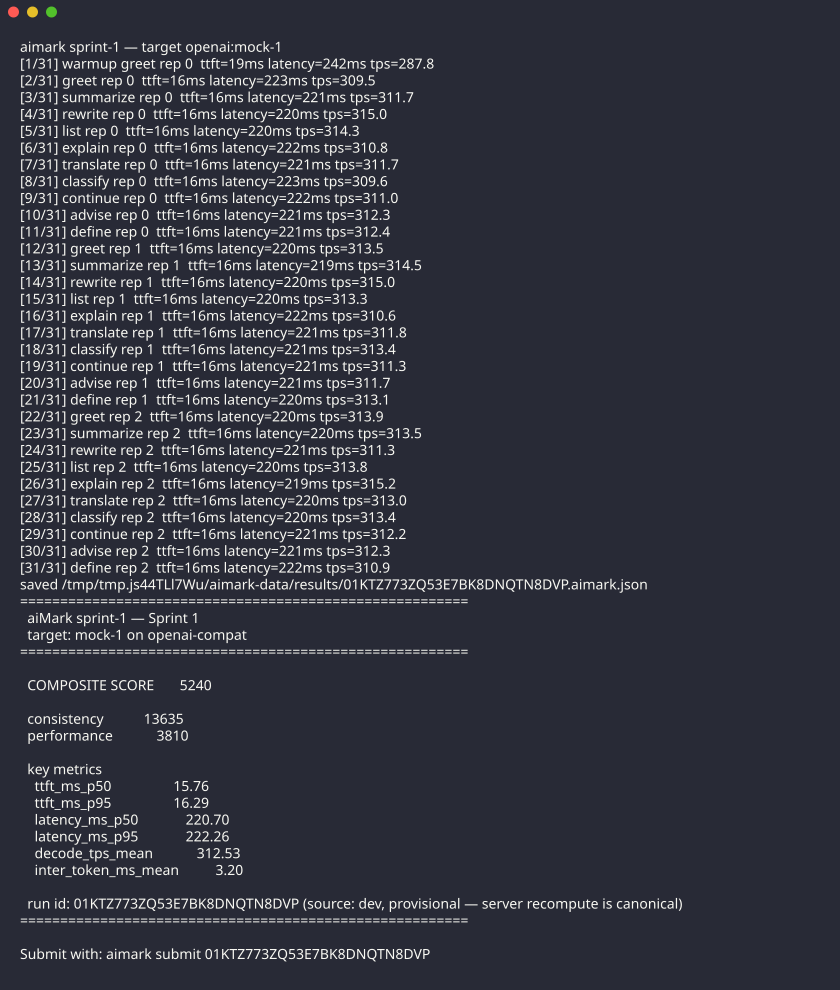
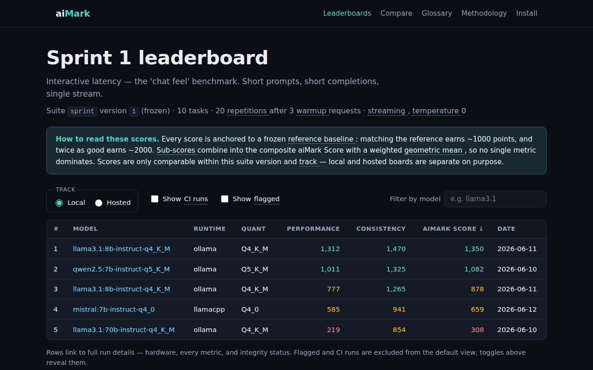
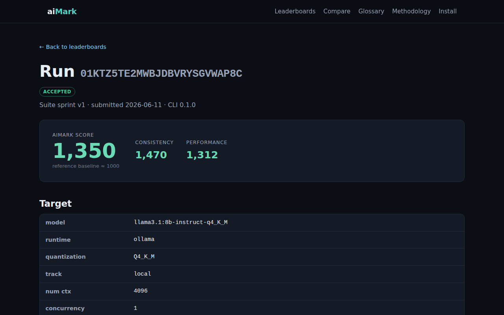

# aiMark

**Like 3DMark, but for AI.**

aiMark is a benchmarking platform for AI inference. A local CLI tool runs standardized, versioned workload suites against AI models — local runtimes (Ollama, llama.cpp, vLLM, LM Studio, MLX) and hosted APIs (Anthropic, OpenAI, Google, Bedrock, OpenRouter) — measures performance, quality, cost-efficiency, and consistency, and submits signed scores to a public site with leaderboards, side-by-side comparisons, and a parameter-impact explorer that shows which parameters actually move scores.

## How it works

```
brew install aimark          # or curl installer / GitHub Releases
aimark detect                # discover your hardware + installed runtimes
aimark run sprint-1 --target ollama:llama3.1:8b
aimark submit                # publish your score (anonymous or GitHub-linked)
```

Your run appears on the public leaderboard, comparable against every other submission for the same suite version and track.

## A look around

> These images are regenerated automatically by the [Docs Images workflow](.github/workflows/docs-images.yaml) — CLI output captured with freeze, site screenshots taken with Playwright against a seeded local stack.

The CLI benchmarking a model and printing its score card:



The public leaderboard (flagged and CI-sourced runs are excluded by default — toggles reveal them):



Every run gets a shareable detail page with scores, hardware, metrics, and integrity status:



The novice-first glossary — every piece of jargon site-wide gets a hover definition:


## What gets measured

| Sub-score           | Aggregates                                                          |
| ------------------- | ------------------------------------------------------------------- |
| **Performance**     | tokens/sec, time-to-first-token, latency p50/p95/p99, throughput    |
| **Quality**         | accuracy on objectively-graded task suites (math, extraction, code) |
| **Cost-Efficiency** | quality per dollar (hosted APIs)                                    |
| **Consistency**     | run-to-run variance                                                 |

Sub-scores roll up into a composite **aiMark Score**, normalized so a frozen reference setup scores ~1000 — just like 3DMark generations, scores are only comparable within a suite version.

## Repository layout

| Path               | Contents                                                            |
| ------------------ | ------------------------------------------------------------------- |
| `apps/cli`         | The `aimark` CLI (Go)                                               |
| `services/api`     | Submission + leaderboard API (TypeScript, Hono, Cloudflare Workers) |
| `services/web`     | Public site (Astro)                                                 |
| `packages/schema`  | JSON Schemas — source of truth shared between Go and TS             |
| `packages/scoring` | Canonical scoring implementation (TS)                               |
| `packages/suites`  | Benchmark suite manifests and task datasets                         |

## Documentation

- [Platform specification](docs/specs/draft/aimark-platform.md) — full architecture, benchmark methodology, scoring model, phased delivery plan

## Development

Toolchain is pinned with [mise](https://mise.jdx.dev):

```
mise install
mise run dev      # local API + site with seeded fixture data
mise run check    # lint + build + test
```

## License

See [LICENSE](LICENSE).
