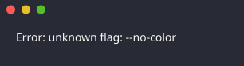
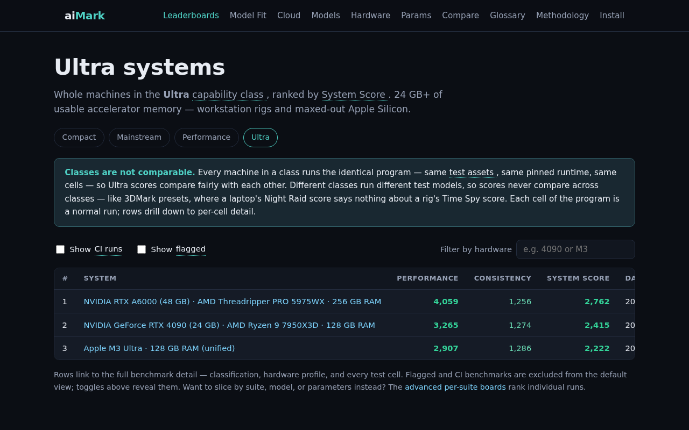
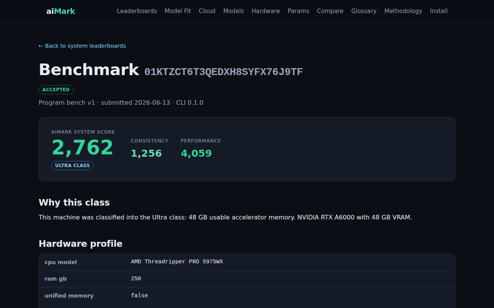
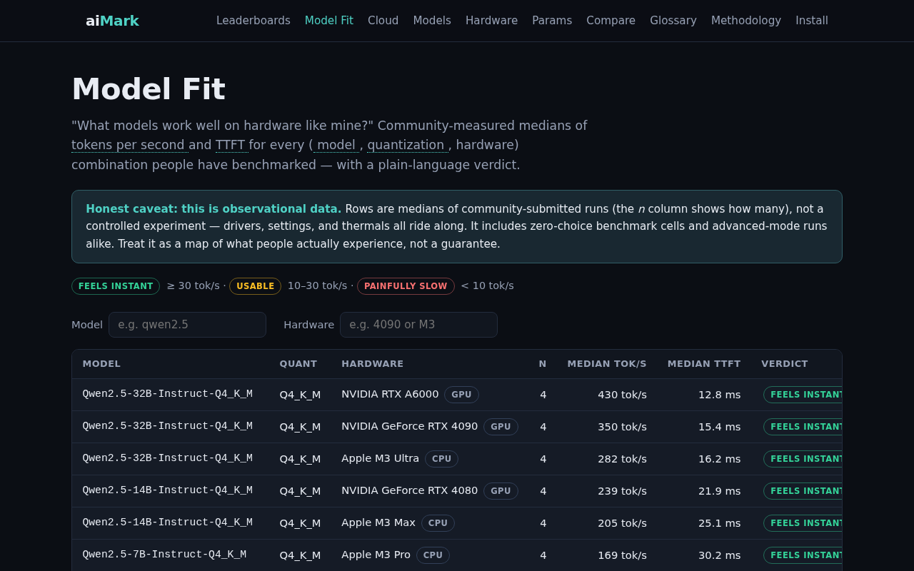
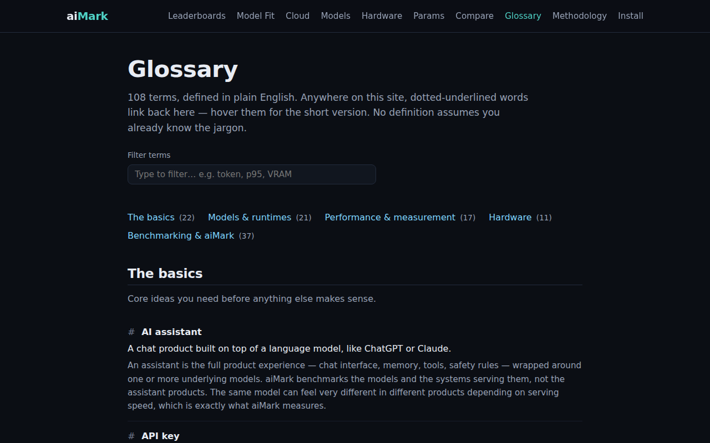

# aiMark

**Like 3DMark, but for AI.**

aiMark is a system benchmark for AI inference — one command scores your machine. The CLI inspects your hardware, assigns it a capability class (Compact / Mainstream / Performance / Ultra), downloads the pinned runtime and model assets for that class, runs the fixed test program, and gives your machine an aiMark System Score you can publish to public class leaderboards. Models are test assets — versioned parts of the benchmark, like 3DMark's scenes — not choices you make.

The collected data answers two questions for everyone: **what hardware should I buy to run local AI**, and **which models work well on hardware like mine** — plus the third, unofficial question: whose rig is fastest.

## How it works

```
curl -fsSL https://aimark.dev/install.sh | sh
aimark                       # that's it: detect → classify → run → System Score
```

`aimark` prints your class and score, then offers to upload — anonymously by default. Your machine appears on its class leaderboard, comparable against every system that ran the identical program. Power users can still hand-pick suites, models, and targets with `aimark run …` (advanced mode, kept off the official class boards), including hosted-API probes that feed the cloud monitoring reference series.

## A look around

> These images are regenerated automatically by the [Docs Images workflow](.github/workflows/docs-images.yaml) — CLI output captured with freeze, site screenshots taken with Playwright against a seeded local stack.

`aimark` — one command: detect, classify, run the program, score the machine:



The class leaderboard — whole machines ranked by System Score within a capability class (flagged and CI-sourced runs are hidden by default):



Each benchmark gets a shareable detail page: System Score, why-this-class, hardware, and per-cell drill-down:



Model Fit answers "what runs well on hardware like mine?" from community data:



The novice-first glossary — every piece of jargon site-wide gets a hover definition:



## What gets measured

| Sub-score           | Aggregates                                                          |
| ------------------- | ------------------------------------------------------------------- |
| **Performance**     | tokens/sec, time-to-first-token, latency p50/p95/p99, throughput    |
| **Quality**         | accuracy on objectively-graded task suites (math, extraction, code) |
| **Cost-Efficiency** | quality per dollar (hosted APIs)                                    |
| **Consistency**     | run-to-run variance                                                 |

Sub-scores roll up into a composite **aiMark Score**, normalized so a frozen reference setup scores ~1000 — just like 3DMark generations, scores are only comparable within a suite version.

## Repository layout

| Path               | Contents                                                            |
| ------------------ | ------------------------------------------------------------------- |
| `apps/cli`         | The `aimark` CLI (Go)                                               |
| `services/api`     | Submission + leaderboard API (TypeScript, Hono, Cloudflare Workers) |
| `services/web`     | Public site (Astro)                                                 |
| `packages/schema`  | JSON Schemas — source of truth shared between Go and TS             |
| `packages/scoring` | Canonical scoring implementation (TS)                               |
| `packages/suites`  | Benchmark suite manifests and task datasets                         |

## Documentation

- [Platform specification](docs/specs/draft/aimark-platform.md) — full architecture, benchmark methodology, scoring model, phased delivery plan

## Development

Toolchain is pinned with [mise](https://mise.jdx.dev):

```
mise install
mise run dev      # local API + site with seeded fixture data
mise run check    # lint + build + test
```

## License

See [LICENSE](LICENSE).
